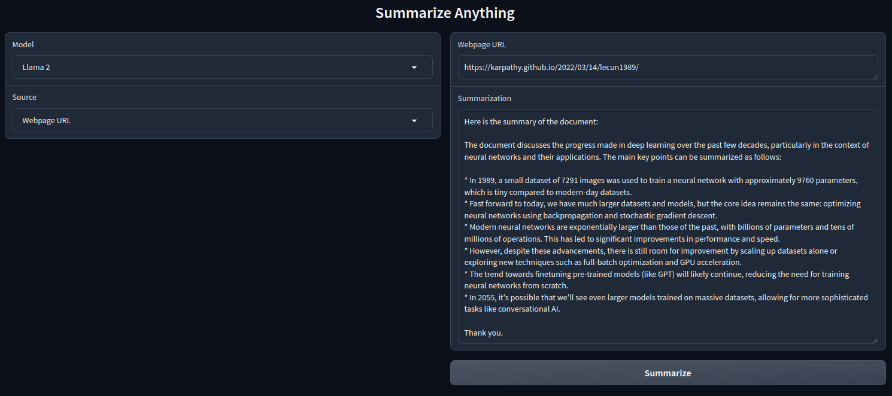

# Summarize Anything!

This basic app is designed as a summarization tool of Youtube video transcripts, PDF files and website's contents. You can basically copy-paste your source document and receive summary of the content. It is empowered using LangChain framework with one of the Llama models. 

## Installation

Download <b>[ollama](https://ollama.com/download)</b> and install one of the LLM models (<b>llama2, llama3:instruct, llama3.1</b>):
```
ollama pull <MODEL>
```

Clone this repository:
```
git clone https://github.com/umutkavakli/summarize-anything.git
```
Install requirements:
```
cd summarize-anything
python -m venv .venv
source .venv/bin/activate
pip install -r requirements.txt
```

Run the script: 
```
python app.py
```


